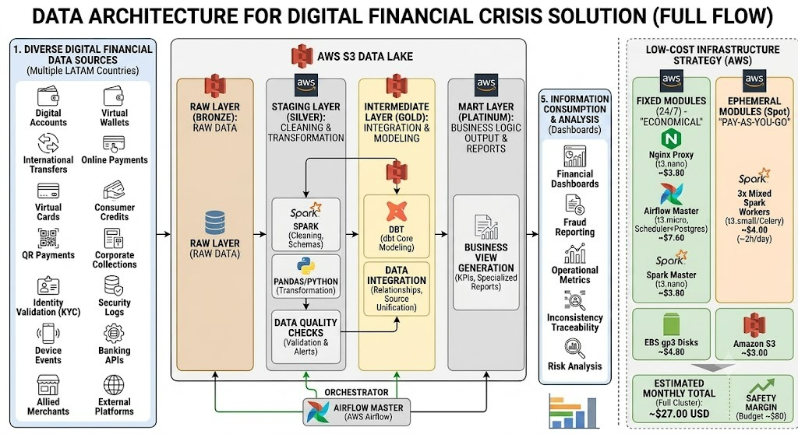

# Orion Financial Crisis Data Platform

Plataforma de datos para ingestar, validar, transformar y preparar informacion financiera digital usando una arquitectura de Data Lake sobre AWS. El proyecto esta orientado a escenarios de crisis financiera digital, fraude, trazabilidad operativa y analitica de riesgo.



## Problema que aborda

Los ecosistemas financieros digitales generan informacion desde multiples fuentes: cuentas digitales, billeteras virtuales, pagos en linea, transferencias internacionales, tarjetas virtuales, creditos de consumo, eventos de dispositivos, KYC, comercios aliados, APIs bancarias y logs de seguridad.

El reto no es solo almacenar esos datos, sino convertirlos en informacion confiable para analisis. En un contexto de riesgo financiero se necesita:

- centralizar fuentes heterogeneas en un repositorio escalable;
- conservar trazabilidad de cada ingesta;
- validar calidad antes de procesar datos;
- transformar archivos crudos en formatos eficientes para analitica;
- preparar capas de datos para reportes, monitoreo, deteccion de fraude e indicadores operativos;
- desplegar la solucion con una infraestructura de bajo costo y cercana a un entorno productivo.

## Solucion propuesta

El proyecto implementa una plataforma de datos basada en AWS S3, Apache Airflow y Apache Spark. La solucion toma datasets financieros desde Kaggle, los sube a una capa Landing en S3, valida los archivos esperados y ejecuta un job Spark que convierte los CSV originales a Parquet en la capa Raw.

La arquitectura sigue el enfoque Medallion/Data Lake por capas:

- **Landing / Bronze:** recepcion de archivos originales tal como llegan desde la fuente.
- **Raw:** datos convertidos a Parquet, enriquecidos con metadata tecnica de ingesta.
- **Staging / Silver:** capa objetivo para limpieza, normalizacion y validaciones mas profundas.
- **Intermediate / Gold:** capa objetivo para integracion, modelado y relacionamiento de entidades.
- **Mart / Platinum:** capa objetivo para vistas de negocio, KPIs, reportes y consumo analitico.

En la imagen de arquitectura se muestra el flujo completo esperado: fuentes financieras diversas entran al Data Lake en S3, Airflow orquesta los procesos, Spark/Python ejecutan limpieza y transformacion, dbt se ubica como pieza de modelado en capas intermedias, y los resultados alimentan dashboards, reportes de fraude, metricas operacionales, trazabilidad de inconsistencias y analisis de riesgo.

## Estado actual de implementacion

El repositorio ya contiene el flujo automatizado desde Kaggle hasta la capa Raw:

```text
Kaggle
  -> Airflow DAG
  -> S3 Landing
  -> Manifest de Landing
  -> Validacion de archivos
  -> Spark Submit
  -> S3 Raw en Parquet
  -> Manifest de Raw
```

El DAG principal es:

```text
architecture/pipelines/dags/financial_crisis_kaggle_to_raw.py
```

El job Spark principal es:

```text
architecture/pipelines/spark_jobs/landing_to_raw_financial_crisis.py
```

Actualmente se procesan tres fuentes financieras:

| Fuente | Origen Kaggle | Archivo |
|---|---|---|
| IEEE-CIS Fraud Detection | `ieee-fraud-detection` | `train_transaction.csv` |
| Credit Card Fraud Detection | `mlg-ulb/creditcardfraud` | `creditcard.csv` |
| PaySim | `ealaxi/paysim1` | `PS_20174392719_1491204439457_log.csv` |

## Como se implementa la solucion

### 1. Orquestacion con Airflow

Apache Airflow coordina el pipeline completo mediante el DAG `financial_crisis_kaggle_to_raw`.

Tareas principales:

```text
build_landing_context
  -> configure_kaggle_credentials
  -> download_unzip_upload_sources_to_landing
  -> generate_landing_manifest
  -> validate_landing_files
  -> spark_landing_to_raw
  -> generate_raw_manifest
```

Airflow se ejecuta con `CeleryExecutor`, apoyado por RabbitMQ como broker de tareas y workers distribuidos para separar la ejecucion del scheduler y los procesos de transformacion.

### 2. Data Lake en Amazon S3

S3 funciona como almacenamiento central del Data Lake. El bucket del proyecto esta estructurado por ambiente, dominio y capa:

```text
s3://orion-financial-crisis-data-395840094505-us-east-2-an/dev/financial_crisis/
```

Capas principales:

```text
landing/
raw/
staging/
intermediate/
mart/
consumption/
logs/
manifests/
dbt/
```

Los archivos de Landing se guardan con particiones logicas por sistema fuente, fecha de ingesta y `run_id`:

```text
landing/source_system=<source_system>/ingestion_date=<YYYY-MM-DD>/run_id=<run_id>/<file_name>
```

### 3. Validacion y trazabilidad

Antes de ejecutar Spark, el pipeline valida que los archivos esperados existan en S3 y que no esten vacios. Si falta un archivo, el proceso se detiene antes de escribir en Raw.

Ademas, el flujo genera manifiestos JSON para dejar evidencia de cada ejecucion:

- manifest de Landing con archivos descargados, tamanos y rutas S3;
- manifest de Raw con datasets generados, formato y ubicaciones de salida.

### 4. Procesamiento distribuido con Spark

Spark lee los CSV desde S3 usando el protocolo `s3a://`, agrega metadata tecnica y escribe cada dataset en formato Parquet dentro de la capa Raw.

Columnas tecnicas agregadas:

```text
source_system
raw_dataset
source_file_name
landing_path
ingestion_date
run_id
raw_ingestion_time
```

La sesion Spark se configura con:

- zona horaria UTC;
- particiones shuffle parametrizables;
- conector Hadoop AWS;
- autenticacion por IAM Instance Profile;
- endpoint S3 de `us-east-2`.

### 5. Infraestructura en AWS

La infraestructura propuesta usa seis instancias EC2:

| Instancia | Servicios |
|---|---|
| `proxy-server` | Nginx Proxy Manager |
| `rabbitmq-server` | RabbitMQ |
| `airflow-master` | Airflow API Server, Scheduler, Triggerer, Flower y Spark Master |
| `airflow-worker-1` | Airflow Worker y Spark Worker |
| `airflow-worker-2` | Airflow Worker y Spark Worker |
| `airflow-worker-3` | Airflow Worker y Spark Worker |

La red se organiza con una VPC, una subred publica para el proxy, una subred privada para Airflow/Spark/RabbitMQ, Internet Gateway, NAT Gateway y Security Groups separados por responsabilidad.

## Stack principal

| Tecnologia | Uso en el proyecto |
|---|---|
| **AWS S3** | Data Lake por capas, almacenamiento de datasets, logs y manifiestos |
| **Apache Airflow** | Orquestacion de ingesta, validacion y ejecucion de Spark |
| **Apache Spark** | Procesamiento distribuido y conversion de CSV a Parquet |
| **PySpark** | Implementacion de jobs de transformacion |
| **Python** | DAGs, validaciones, utilidades y automatizacion |
| **Kaggle API** | Descarga automatizada de datasets financieros |
| **RabbitMQ** | Broker de Celery para ejecucion distribuida de tareas Airflow |
| **CeleryExecutor** | Distribucion de tareas entre workers de Airflow |
| **Docker / Docker Compose** | Empaquetado y despliegue de Airflow, Spark, RabbitMQ y proxy |
| **Nginx Proxy Manager** | Exposicion controlada de UIs internas como Airflow, Flower, Spark y RabbitMQ |
| **IAM Roles** | Acceso seguro a S3 desde EC2 sin credenciales estaticas |
| **Hadoop AWS / S3A** | Conector usado por Spark para leer y escribir en S3 |
| **dbt** | Componente objetivo para modelado analitico en capas Intermediate/Mart |

## Estructura del repositorio

```text
architecture/
  master/                         # Docker Compose de Airflow master
  worker/                         # Docker Compose de workers Airflow
  spark_orion/                    # Dockerfile y compose de Spark standalone
  pipelines/
    dags/                         # DAGs de Airflow
    spark_jobs/                   # Jobs PySpark y utilidades
    dags/common/                  # Funciones comunes para validacion y S3
  rabbitmq/                       # Configuracion de RabbitMQ
  nginx-proxy-manager/            # Configuracion del proxy

docs/                             # Runbooks y guias operativas
requirements/                     # Historias, avances y criterios del proyecto
architecture.jpeg                 # Diagrama de arquitectura objetivo
Readme.md                         # Documentacion principal del proyecto
```

## Ejecucion local o demo

Requisitos principales:

- Docker;
- Docker Compose;
- credenciales o IAM Role con acceso a S3;
- credenciales de Kaggle;
- variables de entorno configuradas segun `docs/env_variables_guide.md`.

Levantar Airflow master:

```bash
docker compose -f architecture/master/docker-compose.yml up -d --build
```

Levantar Spark Master:

```bash
docker compose --env-file architecture/.env -f architecture/spark_orion/master/docker-compose.master.yml up -d --build
```

Levantar Spark Worker:

```bash
docker compose --env-file architecture/.env -f architecture/spark_orion/worker/docker-compose.worker.yml up -d --build
```

Ejecutar el pipeline desde la UI de Airflow activando el DAG:

```text
financial_crisis_kaggle_to_raw
```

Configuracion opcional para una ejecucion manual:

```json
{
  "ingestion_date": "2026-05-29",
  "landing_run_id": "airflow_20260529T120000"
}
```

## Documentacion util

- `docs/aws_infrastructure.md`: guia para construir la red, EC2, Security Groups y despliegue en AWS.
- `docs/kaggle_to_raw_financial_pipeline.md`: detalle del pipeline Kaggle -> Landing -> Raw.
- `docs/airflow_kaggle_to_raw_runbook.md`: runbook operativo del DAG principal.
- `docs/spark_ec2_configuration.md`: configuracion de Spark en EC2.
- `docs/env_variables_guide.md`: variables de entorno usadas por Airflow y workers.

## Valor tecnico del proyecto

Este repositorio demuestra una plataforma de datos end-to-end con tecnologias usadas en entornos reales de ingenieria de datos:

- ingesta automatizada desde fuentes externas;
- Data Lake por capas sobre S3;
- procesamiento distribuido con Spark;
- orquestacion robusta con Airflow;
- ejecucion distribuida con Celery y RabbitMQ;
- infraestructura reproducible con Docker Compose;
- seguridad basada en IAM Roles;
- trazabilidad mediante particiones, metadata tecnica y manifiestos.

La base actual deja listo el camino para completar las capas Staging, Intermediate, Mart y Consumption, incorporar dbt para modelado analitico y conectar herramientas de BI para dashboards financieros, monitoreo de fraude y analisis de riesgo.
