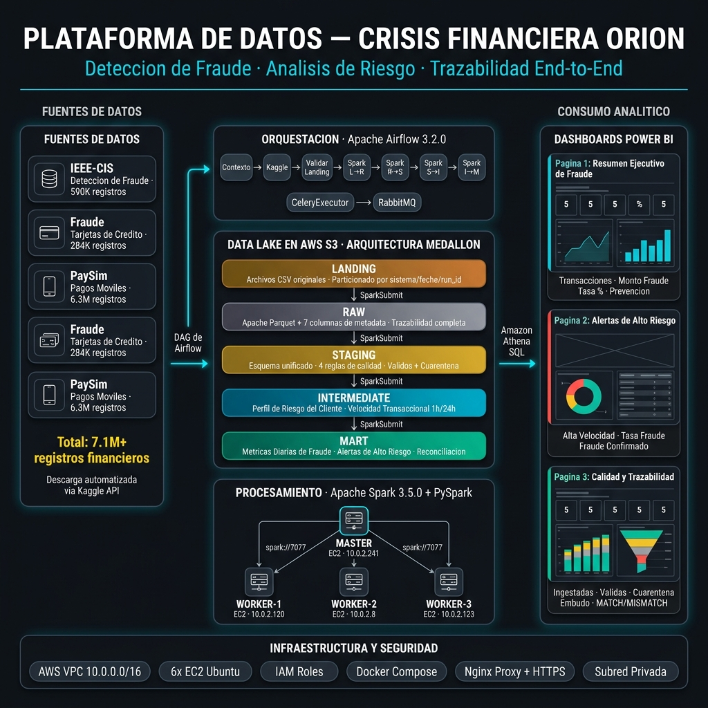
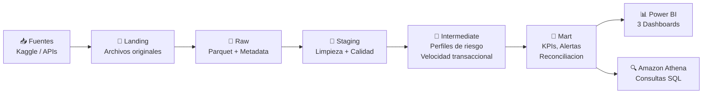
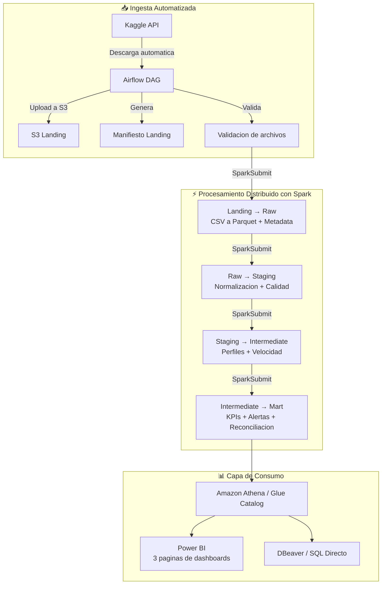
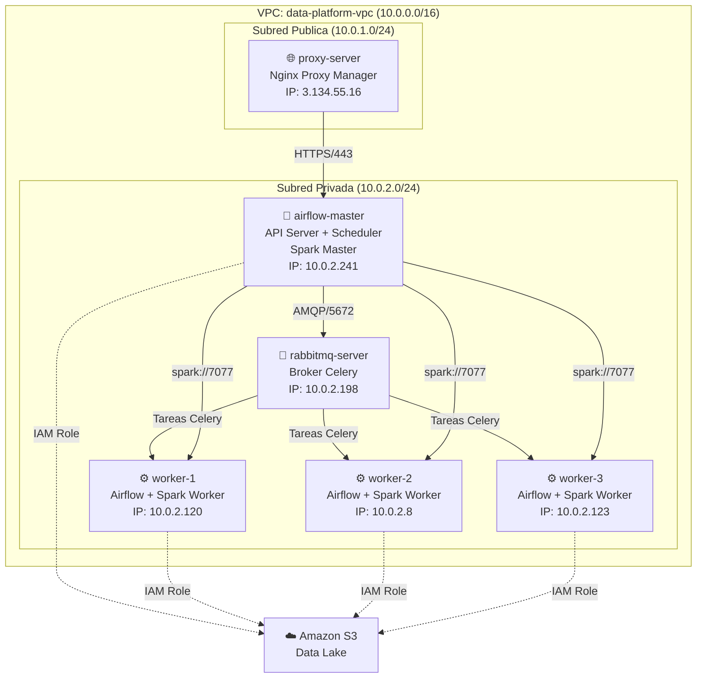

# Orion Financial Crisis — Data Platform

**Plataforma de datos end-to-end para la deteccion de fraude, analisis de riesgo y trazabilidad operacional de una entidad financiera digital.**



---

## 1. El Problema

Una entidad financiera digital con presencia en multiples paises de Latinoamerica procesa **millones de transacciones diarias** desde cuentas digitales, billeteras virtuales, pagos en linea, transferencias internacionales, tarjetas virtuales y creditos de consumo. Durante el ultimo anio la organizacion enfrento una crisis operacional critica:

| Problema detectado | Impacto directo |
|---|---|
| Aumento significativo de transacciones sospechosas | Perdidas economicas por fraude no detectado |
| Cuentas fraudulentas en crecimiento | Exposicion regulatoria y reputacional |
| Transferencias duplicadas e inconsistencias entre reportes | Decisiones basadas en informacion parcial |
| Retrasos en conciliaciones financieras | Incapacidad de respuesta operacional |
| Falsos positivos en monitoreo de riesgo | Operaciones legitimas rechazadas, afectando clientes |
| Ausencia de trazabilidad del ciclo completo de operaciones | Imposibilidad de auditorias regulatorias confiables |
| Multiples areas con metricas contradictorias | Falta de una fuente unica de verdad |

> **Diagnostico clave:** La organizacion estaba tomando decisiones criticas basadas en informacion fragmentada, sin una capa analitica centralizada ni capacidad de procesamiento distribuido sobre los volumenes reales de datos.

---

## 2. Nuestra Solucion

Disenamos y desplegamos una **plataforma de datos completa sobre AWS** que centraliza, valida, transforma y analiza la informacion financiera desde su origen hasta dashboards ejecutivos en Power BI.

La solucion sigue la **arquitectura Medallion (Data Lake por capas)**, un patron de la industria que separa la informacion cruda de la informacion limpia y de la informacion lista para consumo analitico:



### Flujo completo del pipeline



---

## 3. Arquitectura de la Infraestructura en AWS

Toda la solucion corre sobre **6 instancias EC2** dentro de una VPC con subredes publica y privada, Security Groups segmentados por responsabilidad y acceso a S3 mediante IAM Roles (sin credenciales estaticas).



| Instancia | Servicios | Tipo |
|---|---|---|
| `proxy-server` | Nginx Proxy Manager (HTTPS, dominios) | `t3.small` |
| `rabbitmq-server` | RabbitMQ (Broker de Celery) | `t3.medium` |
| `airflow-master` | Airflow API Server, Scheduler, Triggerer, Flower, Spark Master | `t3.large` |
| `airflow-worker-1/2/3` | Airflow Celery Worker + Spark Worker | `t3.medium` |

---

## 4. Data Lake por Capas en S3

El bucket `orion-financial-crisis-data` organiza la informacion en capas logicas que garantizan trazabilidad y calidad progresiva:

```
s3://orion-financial-crisis-data/dev/financial_crisis/
├── landing/          ← Archivos CSV originales de Kaggle
├── raw/              ← Parquet + metadata tecnica de ingesta
├── staging/          ← Eventos normalizados + reglas de calidad
│   ├── financial_fraud_events/    ← Registros validos
│   └── quality/
│       ├── quarantined_events/    ← Registros en cuarentena
│       └── quality_report_*.json  ← Reporte de calidad por ejecucion
├── intermediate/     ← Modelos analiticos enriquecidos
│   ├── int_customer_risk_profile/ ← Perfil de riesgo por cliente
│   └── int_transaction_velocity/  ← Velocidad transaccional 1h/24h
├── mart/             ← KPIs y vistas de negocio finales
│   ├── mart_daily_fraud_metrics/      ← Metricas diarias de fraude
│   ├── mart_high_risk_alerts/         ← Alertas de alto riesgo
│   └── mart_data_reconciliation/      ← Auditoria de reconciliacion
├── logs/             ← Logs remotos de Airflow
└── manifests/        ← Manifiestos JSON de cada ejecucion
```

---

## 5. Que Hace Cada Capa (Detalle Tecnico)

### 5.1 Landing → Raw (Ingesta)

**Objetivo:** Convertir archivos CSV originales a formato Parquet columnar y enriquecer cada registro con metadata de trazabilidad.

| Columna de metadata | Proposito |
|---|---|
| `source_system` | Identifica el sistema de origen (paysim, ieee, credit_card) |
| `raw_dataset` | Nombre del dataset dentro de la capa Raw |
| `source_file_name` | Archivo CSV original descargado |
| `landing_path` | Ruta S3 exacta del archivo en Landing |
| `ingestion_date` | Fecha de ingesta (YYYY-MM-DD) |
| `run_id` | Identificador unico del DAG run de Airflow |
| `raw_ingestion_time` | Timestamp UTC de escritura en Raw |

### 5.2 Raw → Staging (Limpieza y Calidad)

**Objetivo:** Unificar las 3 fuentes en un esquema estandarizado, aplicar reglas de calidad y separar registros validos de los que van a cuarentena.

**Esquema unificado:**

| Campo | Descripcion |
|---|---|
| `event_id` | UUID unico por evento |
| `source_system` | Sistema de origen |
| `transaction_id` | Identificador de la transaccion |
| `event_timestamp` | Timestamp normalizado del evento |
| `amount` | Monto de la transaccion |
| `transaction_type` | Tipo de operacion (TRANSFER, PAYMENT, etc.) |
| `origin_account_id` | Cuenta origen |
| `destination_account_id` | Cuenta destino |
| `is_fraud` | Etiqueta de fraude (0/1) |
| `is_flagged_fraud` | Marcado por el sistema antifraude |

**Reglas de calidad aplicadas:**

| Regla | Descripcion | Si falla |
|---|---|---|
| `invalid_amount` | El monto debe ser positivo | Cuarentena |
| `invalid_fraud_label` | `is_fraud` debe ser 0 o 1 | Cuarentena |
| `missing_transaction_id` | No puede ser nulo | Cuarentena |
| `missing_event_timestamp` | No puede ser nulo | Cuarentena |

### 5.3 Staging → Intermediate (Enriquecimiento Analitico)

**Objetivo:** Construir modelos analiticos que permitan detectar patrones de riesgo.

**Perfil de riesgo del cliente** (`int_customer_risk_profile`):

| Metrica | Calculo |
|---|---|
| `total_transaction_amount` | Suma total de montos por cliente |
| `transaction_count` | Cantidad total de transacciones |
| `average_transaction_amount` | Promedio de monto por transaccion |
| `total_fraud_events` | Cantidad de fraudes asociados |
| `fraud_rate` | Tasa historica de fraude del cliente |

**Velocidad transaccional** (`int_transaction_velocity`):

| Metrica | Ventana temporal |
|---|---|
| `tx_count_1h` / `tx_amount_1h` | Transacciones en la ultima hora |
| `tx_count_24h` / `tx_amount_24h` | Transacciones en las ultimas 24 horas |

### 5.4 Intermediate → Mart (KPIs y Alertas)

**Objetivo:** Generar las vistas finales de negocio listas para dashboards y auditoria.

**Metricas diarias de fraude** (`mart_daily_fraud_metrics`):
- Total de transacciones, monto total, transacciones fraudulentas, monto de fraude, tasa de fraude y monto de prevencion de perdidas, agrupados por `source_system` y `event_date`.

**Alertas de alto riesgo** (`mart_high_risk_alerts`):
- Se disparan cuando una cuenta cumple al menos una de estas condiciones:
  - Mas de 10 transacciones en 24 horas (`high_velocity_24h`)
  - Tasa historica de fraude mayor al 20% (`high_customer_historic_fraud_rate`)
  - Transaccion confirmada como fraude (`confirmed_fraud_transaction`)

**Reconciliacion de datos** (`mart_data_reconciliation`):
- Compara filas totales en Raw vs filas validas + cuarentena en Staging.
- Si la diferencia es 0 → `MATCH` (no se perdieron registros en el proceso).
- Si la diferencia es diferente de 0 → `MISMATCH` (alerta de inconsistencia).

---

## 6. Por Que Elegimos Cada Tecnologia

| Tecnologia | Rol en la solucion | Por que la elegimos |
|---|---|---|
| **AWS S3** | Data Lake central | Almacenamiento ilimitado, bajo costo, integracion nativa con todo el ecosistema AWS. Ideal para separar datos por capas sin depender de una base de datos relacional. |
| **Apache Airflow** | Orquestacion del pipeline | Permite programar, monitorear y reintentar cada paso del flujo. Su modelo de DAGs hace explicita la dependencia entre tareas. CeleryExecutor permite distribuir carga entre workers. |
| **Apache Spark** | Procesamiento distribuido | Procesa millones de registros en paralelo usando multiples maquinas. Soporte nativo para Parquet, S3 y operaciones de ventana temporal necesarias para calcular velocidad transaccional. |
| **RabbitMQ** | Broker de mensajeria | Distribuye las tareas de Airflow entre los workers de forma confiable. Mas ligero que Redis para nuestro volumen y permite monitoreo visual. |
| **Docker Compose** | Empaquetado y despliegue | Cada servicio corre en contenedores aislados. Reproducible en cualquier EC2 con un solo comando. |
| **Nginx Proxy Manager** | Punto de entrada seguro | Expone las UIs internas (Airflow, Flower, Spark, RabbitMQ) mediante HTTPS y dominios propios sin abrir puertos directamente a internet. |
| **IAM Roles** | Seguridad de acceso a S3 | Las EC2 acceden a S3 sin credenciales estaticas. El rol se hereda automaticamente dentro de los contenedores Docker. |
| **Amazon Athena** | Consultas SQL sobre S3 | Permite consultar los archivos Parquet del Data Lake directamente con SQL estandar, sin necesidad de un motor de base de datos. Ideal para conectar Power BI. |
| **Power BI** | Dashboards ejecutivos | Herramienta de visualizacion solicitada por la direccion. Se conecta a Athena mediante script Python (`pyathena`) para importar las 3 tablas de la capa Mart. |
| **PySpark** | Logica de transformacion | Python es el lenguaje del equipo. PySpark permite escribir transformaciones complejas (Window Functions, UDFs) de forma legible y testeable. |
| **Kaggle API** | Ingesta automatizada | Descarga los datasets financieros directamente desde la linea de comandos, integrado en el DAG de Airflow sin intervencion manual. |

---

## 7. Fuentes de Datos Financieros

Utilizamos tres datasets publicos de Kaggle que simulan escenarios reales de fraude financiero:

| Fuente | Origen Kaggle | Registros | Escenario que simula |
|---|---|---|---|
| **IEEE-CIS Fraud Detection** | `ieee-fraud-detection` | ~590K | Transacciones de comercio electronico con etiqueta de fraude, datos de dispositivos y comportamiento |
| **Credit Card Fraud Detection** | `mlg-ulb/creditcardfraud` | ~284K | Transacciones reales de tarjetas de credito europeas con fraude altamente desbalanceado |
| **PaySim** | `ealaxi/paysim1` | ~6.3M | Simulacion de transacciones moviles (transferencias, pagos, retiros) con fraude sintetico |

> **Total combinado:** mas de 7 millones de registros financieros procesados en cada ejecucion del pipeline.

---

## 8. Dashboards en Power BI (3 Paginas)

La capa de consumo final se materializa en **3 paginas de Power BI** conectadas a Amazon Athena mediante script Python (`pyathena`).

**Tema visual del dashboard:**

| Propiedad | Valor |
|---|---|
| Fondo | `#0D1117` (negro oscuro) |
| Color primario | `#00B4D8` (azul cyan) |
| Color de alerta | `#FF4444` (rojo) |
| Color de exito | `#00C896` (verde) |

Cada pagina incluye **botones de navegacion** (Insertar → Botones → En blanco → Accion: Navegacion de pagina) para moverse entre las 3 vistas.

---

### Pagina 1: 🔍 Resumen Ejecutivo de Fraude Financiero

**Tarjetas KPI (fila superior):**

| # | Medida | Formato |
|---|---|---|
| 1 | Total Transacciones | Numero entero |
| 2 | Volumen Total Procesado | Moneda |
| 3 | Monto Total de Fraude | Moneda en rojo |
| 4 | Tasa de Fraude | Decimal 1 lugar + % |
| 5 | Prevencion de Perdidas | Moneda en verde |

**Grafico de lineas:** Tendencia temporal de `total_amount` vs `fraud_amount` por `event_date`.

**Grafico de barras agrupadas:** Comparativa de metricas entre las 3 fuentes (`source_system`: paysim, credit_card, ieee_cis).

**Segmentador (Slicer):** Filtro por `source_system` y rango de `event_date`.

---

### Pagina 2: 🚨 Monitor de Alertas de Alto Riesgo

**Grafico de Donut:** Distribucion de alertas por `alert_reason`:
- `high_velocity_24h` — Mas de 10 transacciones en 24 horas
- `high_customer_historic_fraud_rate` — Tasa historica de fraude > 20%
- `confirmed_fraud_transaction` — Transaccion confirmada como fraude

**Tabla de detalle (drill-down):**

| Columna | Descripcion |
|---|---|
| `origin_account_id` | Cuenta origen de la alerta |
| `amount` | Monto de la transaccion |
| `tx_count_24h` | Transacciones en ultimas 24h |
| `customer_historic_fraud_rate` | Tasa historica de fraude del cliente |
| `alert_reason` | Razon del disparo de la alerta |
| `source_system` | Sistema de origen |

**Filtros interactivos:** Por `source_system`, `event_date` y tipo de `alert_reason`.

---

### Pagina 3: ⚙️ Calidad y Trazabilidad del Pipeline

**Tarjetas KPI (fila superior):**

| # | Medida | Formato |
|---|---|---|
| 1 | Filas Ingestadas | Numero entero |
| 2 | Filas Validas | Numero entero en verde |
| 3 | Filas Cuarentena | Numero entero en amarillo |
| 4 | Tasa Calidad % | Decimal 1 lugar + % |
| 5 | Estado Pipeline | Texto (MATCH/MISMATCH) |

**Grafico 1 — Distribucion de calidad:**
- Tipo: Grafico de barras apiladas 100%
- Eje X: `ingestion_date`
- Barra 1: Filas Validas (verde `#00C896`)
- Barra 2: Filas Cuarentena (amarillo)
- Titulo: *"Distribucion de Calidad por Ingesta"*

**Grafico 2 — Embudo del pipeline:**
- Tipo: Grafico de embudo
- Grupo: Etiquetas manuales: "Raw", "Validas", "Cuarentena"
- Valores: Filas Ingestadas, Filas Validas, Filas Cuarentena
- Titulo: *"Embudo de Calidad del Pipeline"*

**Tabla de trazabilidad:**

| Columna | Formato condicional |
|---|---|
| `ingestion_date` | — |
| `run_id` | — |
| `raw_total_rows` | — |
| `staging_valid_rows` | — |
| `staging_quarantine_rows` | — |
| `reconciliation_difference` | — |
| `reconciliation_status` | `MATCH` = verde, `MISMATCH` = rojo |

---

## 9. Estructura del Repositorio

```
architecture/
  master/                         # Docker Compose de Airflow Master
  worker/                         # Docker Compose de Airflow Workers
  spark_orion/                    # Dockerfile y compose de Spark Standalone
  pipelines/
    dags/                         # DAGs de Airflow
      common/                     # Funciones comunes (validacion, S3, landing)
    spark_jobs/                   # Jobs PySpark por capa
      landing_to_raw_financial_crisis.py
      raw_to_staging_financial_crisis.py
      staging_to_intermediate_financial_crisis.py
      intermediate_to_mart_financial_crisis.py
      session.py                  # Configuracion de SparkSession con S3A
      metadata.py                 # Inyeccion de metadata tecnica
  rabbitmq/                       # Configuracion de RabbitMQ
  nginx-proxy-manager/            # Configuracion del proxy

docs/                             # Runbooks, guias y documentacion operativa
requirements/                     # Historias de usuario y criterios del proyecto
architecture.jpeg                 # Diagrama de arquitectura objetivo
Readme.md                         # Este documento
```

---

## 10. Como Ejecutar el Pipeline

### Prerrequisitos
- Docker y Docker Compose instalados en cada EC2.
- IAM Role `orion-data-platform-s3-role` asignado a las instancias Master y Workers.
- Credenciales de Kaggle configuradas como Variables en Airflow.

### Levantar la plataforma

```bash
# En airflow-master:
cd ~/Done-data-platform/architecture/master
docker compose up -d --build

# Spark Master:
docker network create spark-net 2>/dev/null || true
docker compose --env-file ../.env_master -f ../spark_orion/master/docker-compose.master.yml up -d --build

# En cada airflow-worker:
cd ~/Done-data-platform/architecture/worker
docker compose up -d --build

# Spark Worker:
docker network create spark-net 2>/dev/null || true
docker compose --env-file ../.env_worker1 -f ../spark_orion/worker/docker-compose.worker.yml up -d --build
```

### Ejecutar el pipeline
1. Acceder a la UI de Airflow mediante `https://orion-airflow.coderhivex.com`.
2. Activar el DAG `financial_crisis_kaggle_to_raw`.
3. Hacer clic en **Trigger DAG** para iniciar la ejecucion.

El pipeline ejecutara automaticamente las 10 tareas secuenciales:

```
build_landing_context
  → configure_kaggle_credentials
  → download_unzip_upload_sources_to_landing
  → generate_landing_manifest
  → validate_landing_files
  → spark_landing_to_raw
  → generate_raw_manifest
  → spark_raw_to_staging
  → spark_staging_to_intermediate
  → spark_intermediate_to_mart
```

---

## 11. Resultados Obtenidos

| Indicador | Antes | Despues |
|---|---|---|
| Fuentes centralizadas | Fragmentadas en multiples sistemas | Unificadas en un Data Lake en S3 por capas |
| Trazabilidad de operaciones | Inexistente | Completa: metadata tecnica en cada registro + manifiestos JSON |
| Deteccion de anomalias | Manual y reactiva | Automatizada: alertas por velocidad transaccional y tasa de fraude |
| Calidad de datos | Sin validacion | Reglas automaticas con cuarentena y reportes por ejecucion |
| Reconciliacion de datos | No se realizaba | Automatica: verificacion MATCH/MISMATCH entre capas |
| Tiempo de procesamiento | Horas/dias con procesos manuales | Minutos con Spark distribuido en 3 workers |
| Consumo analitico | Reportes manuales en Excel | 3 dashboards interactivos en Power BI conectados a Athena |

---

## 12. Stack Tecnologico Completo

| Tecnologia | Version | Uso |
|---|---|---|
| AWS S3 | — | Data Lake por capas |
| AWS EC2 | Ubuntu 24.04 LTS | Infraestructura de computo |
| AWS IAM Roles | — | Seguridad de acceso a S3 |
| Amazon Athena | — | Consultas SQL sobre Parquet en S3 |
| Apache Airflow | 3.2.0 | Orquestacion de pipelines |
| Apache Spark | 3.5.0 | Procesamiento distribuido |
| PySpark | 3.5.0 | Jobs de transformacion |
| Python | 3.x | DAGs, validaciones, scripts |
| RabbitMQ | latest | Broker de Celery |
| Docker / Docker Compose | latest | Contenedorizacion |
| Nginx Proxy Manager | latest | Proxy reverso con HTTPS |
| Hadoop AWS / S3A | 3.3.4 | Conector de Spark hacia S3 |
| Power BI Desktop | latest | Dashboards ejecutivos |
| pyathena | 3.32.0 | Conector Python para Athena |
| Kaggle API | latest | Descarga automatizada de datasets |
